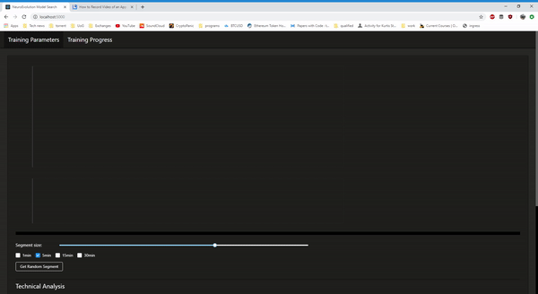

# Tensorflow NeuroEvolution BTC Trader
Tensorflow is used to build a population of models that breed and mutate iteratively. The initial population is built given a specified network topology and assigned random weights. For each generation, these weights are randomly mutated and each network is assigned a fitness value based on their performance. A pooling algorithm is used to select models for the next generation and the process is repeated. Models with a higher fitness tend to make it to the next generation where their weights are mutated and ideally create a higher performing generation    



### Repository still in development     

---   

## Usage   
Using the trading framework is very easy. All you need to do is specify the mutation rate, mutation scale, and network parameters. This is passed into the _Population()_ object which constructs a population with the given parameters. In _pop.evolve()_ the fitness of each model is used in a pooling algorithm to decide which models to use in the next generation. The models are then copied over to the next generation and randomly mutated based on the _w_mutation_rate_ parameter. In _pop.run()_ the models are fed inputs and the fitness is assigned based on how it performs in the fitness callback. The best model is saved and tested and the whole process starts over again until the desired amount of generations is achieved.
```python
# genetic parameters
pop_size = 25
w_mutation_rate = 0.05
mutation_scale = 0.3
generations = 25

# network parameters
network_params = {
    'network': 'feedforward',
    'input': 5,
    'hidden': [16, 16, 16],             
    'output': 2
}

# build initial population
pop = Population(network_params,
                 pop_size,
                 mutation_scale,
                 w_mutation_rate,)

# run for set number of generations
for g in range(generations):
    pop.evolve(g)
    gen_best = pop.run(inputs_train, price_train, fitness_callback=calculate_profit)
    gen_best.save()
    pop.test(inputs_test, price_test, fitness_callback=calculate_profit)
```
### Population() parameters   
- network_params: This is a dictionary that specifies network parameters
- pop_size: This is the size of the population that will be used through each generation
- mutation_scale: This is the scale of the mutation if a weight is being mutated
- w_mutation_rate: This is the change a weight will be mutated when iterating over the weights
- b_mutation_rate=0: This is the change a bias will be mutated when iterating over the biases (experimental)
- mutation_decay=1.0: This is the rate at which the mutation scale decays at after each generation
- breeding_ratio=0: Each generation is created through mutation by default. However, you can choose to breed models instead
- verbose=True: Printing progress to console.

### Network types
- feedforward   
- convolutional (experimental)   
- recurrent (to be implemented)   
Feedforward network types are far faster than the other networks. This is because the models are smaller and they are built differently. The model is constructed using matrix multiplication rather than _tf.layers_ or _tf.keras_. Future versions of the framework will involve speeding up the other networks in this manner.

### Fitness callback   
A callback function needs to be passed into _pop.run()_ so it can know how to evaluate the network. In a trading environment this is usually the profit the model made.   
```python
def calculate_profit(trades, trade_prices):
    btc_wallet = 0.
    starting_cash = 100.
    usd_wallet = starting_cash
    fee = 0.001

    holding = False
    for idx, trade in enumerate(trades):
        if holding and not np.argmax(trade):
            holding = False
            usd_wallet = btc_wallet * trade_prices[idx] * (1 - fee)
        if not holding and np.argmax(trade):
            holding = True
            btc_wallet = usd_wallet / trade_prices[idx] * (1 - fee)

    return (usd_wallet / starting_cash - 1) * 100
```
---   

### Sample verbose output
```
creating population 1
evaluating population....
average score: -2.26%
best score: 148.30%
record score: 148.30%
time: 4.54s
test score: 1.25%
=========================
creating population 2
evaluating population....
average score: 21.37%
best score: 168.31%
record score: 168.31%
time: 2.88s
test score: -11.39%
=========================
creating population 3
evaluating population....
average score: 40.26%
best score: 280.08%
record score: 280.08%
time: 2.83s
test score: -7.51%
...
...
```
